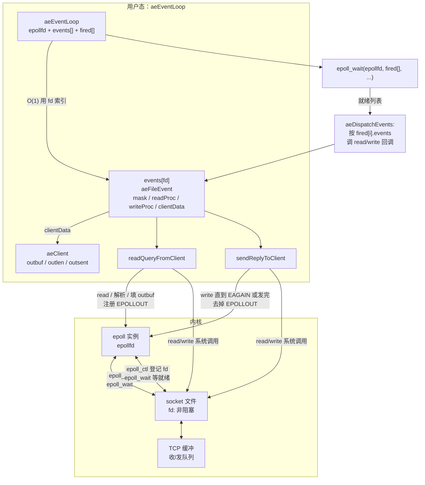

# Reactor + epoll：Redis 式 I/O 多路复用与本目录实现

本目录实现的是 **单线程事件循环 + epoll** 的雏形（命名与结构与 Redis 的 `ae` 事件库相近）：用 **一个 epoll 实例** 监听大量套接字上的 **可读 / 可写** 事件，在 **非阻塞** 描述符上反复 **`read` / `write` / `accept`**，直到 `EAGAIN`，从而把「等数据」从阻塞线程里挪到 **内核的就绪队列 + `epoll_wait`** 上。

下文顺序：**传统 I/O 模型对比 → 本目录架构（`reactor.h`）→ epoll 与 `epollfd` → 为何必须非阻塞 → LT / ET → `epoll_wait` 与常见问题 → 总览图**。

---

## 1. 传统 I/O 模型与 epoll 的对比

### 1.1 阻塞式「一线程一连接」

每个连接一个线程（或进程），`read`/`write` 在数据未就绪时 **阻塞在内核**。实现简单，但连接数上去后 **线程栈、调度器开销、上下文切换** 都会爆炸，CPU 大量时间花在「等」而不是「算」上。

### 1.2 非阻塞 + 忙轮询（`O_NONBLOCK` + 循环 `read`）

所有套接字设为非阻塞，单线程里 `while(1)` 对每个 fd 尝试 `read`。没有阻塞，但 **没有就绪信息**：大量时间浪费在 **对未就绪 fd 的系统调用** 上，CPU 占用高，扩展性差。

### 1.3 `select` / `poll`

内核提供 **「哪些 fd 可能可读/可写」** 的就绪集合；用户传入 **fd 集合**，内核填充结果。语义清晰，但 **`select` 有 fd 数量上限且每次要拷贝大位图**；**`poll` 用数组但每次仍要传入全部关心的 fd**，连接数 **N** 很大时，**用户态与内核态之间传递、扫描集合的成本近似 O(N)**，成为瓶颈。

### 1.4 epoll（Linux 2.6+）

内核维护 **「兴趣列表」**（你通过 `epoll_ctl` 增删改 fd 与事件掩码）。等待就绪时用 **`epoll_wait`**：内核只返回 **当前就绪的 fd 列表**，且 **与总连接数解耦**，适合 **大量 idle 连接、少量同时活跃** 的场景（典型就是 Redis、Nginx、memcached 这类）。

**Redis**：在 Linux 上默认用 **epoll** 作为 `ae` 的后端（另有 `kqueue`/`evport` 等）；本目录代码是教学级子集，但 **「非阻塞 fd + epoll LT + 读写回调 + 每连接状态」** 与 Redis 主线程模型一致。

---

## 2. 本目录采用的架构（`reactor.h` 中的三块）

核心思想：**内核只告诉你「哪个 fd 上发生了什么」**；**谁处理、用什么状态处理** 放在用户态的 **`aeFileEvent` / `aeClient` / `aeEventLoop`** 里。

### 2.1 `aeFileEvent`：每个 fd 上的「逻辑事件」与回调

```28:33:System/reactor/reactor.h
typedef struct aeFileEvent {
    int mask; // this fd is readable or writable.
    aeFileProc *readFileProc; // callback functions
    aeFileProc *writeFileProc;
    void* clientData;
} aeFileEvent;
```

- **`mask`**：本库关心的 **读 / 写** 兴趣（`AE_READABLE` / `AE_WRITABLE`），与 `epoll_ctl` 里注册的 `EPOLLIN` / `EPOLLOUT` 对应。
- **`readFileProc` / `writeFileProc`**：该 fd **可读或可写时** 调用的函数指针（Redis 里同样是分离的读处理器 / 写处理器）。
- **`clientData`**：通常指向 **`aeClient`**，表示 **这条连接上的业务状态**（输出缓冲、协议解析状态等）。

### 2.2 `aeClient`：连接级状态（输出队列）

```36:40:System/reactor/reactor.h
typedef struct aeClient {
    unsigned char outbuf[16384];
    size_t outlen;
    size_t outsent;
} aeClient;
```

- Redis 里对应概念是 **`client` 结构** 上的 **回复缓冲 / 回复链表** 等；这里简化为 **单段输出缓冲 + 已发送游标**。
- **读回调**把要写出的数据放进 `outbuf`，再注册 **`AE_WRITABLE`**；**写回调**在非阻塞 `write` 下 **部分写**，直到发完再删掉写事件，避免忙等。

### 2.3 `aeEventLoop`：循环体 + 以 fd 为下标的表

```43:47:System/reactor/reactor.h
typedef struct aeEventLoop {
    int epollfd; // what is epoll's fd?
    aeFileEvent events[MAX_FDS]; // using fd as indexes
    struct epoll_event fired[MAX_EVENTS]; // the events that epoll_wait returned.
} aeEventLoop;
```

- **`epollfd`**：`epoll_create1` 得到的 **epoll 实例句柄**；后面所有 `epoll_ctl` / `epoll_wait` 都针对它。
- **`events[MAX_FDS]`**：**用整数 fd 当下标** 的 **用户态侧表**（Redis `ae` 在部分平台上也采用「fd 作索引」以 O(1) 找到 `aeFileEvent`）。**要求 fd 落在 `[0, MAX_FDS)`**，小服务足够；若 fd 可能很大，应改成 **哈希表 / 动态数组** 等映射。
- **`fired[MAX_EVENTS]`**：`epoll_wait` 的 **输出数组**，每次唤醒后内核把 **就绪事件** 填在这里；本库再遍历它，用 `ee.data.fd` 回到 `events[fd]` 调回调。

**与 Redis 的对应关系（概念上）**

| Redis（概念） | 本目录 |
|---------------|--------|
| `aeEventLoop` | `aeEventLoop` |
| `aeFileEvent` + `rfileProc`/`wfileProc` | `aeFileEvent` + `readFileProc`/`writeFileProc` |
| `client` 输出缓冲 | `aeClient` |
| `aeApiPoll` → epoll_wait | `aeProcessEvents` → `epoll_wait` |

---

## 3. `epollfd` 与 epoll 本身的机制

### 3.1 `epollfd` 是什么？

`epollfd` 是内核里一个 **「epoll 实例」** 的文件描述符。你可以把它理解成：

- 内核里有一张 **与这个实例绑定的表**：每一行是 **(fd, 关心的事件掩码, 用户自定义 u64 等)**；
- **`epoll_ctl(EPOLL_CTL_ADD/MOD/DEL)`** 维护这张表；
- **`epoll_wait`** 阻塞（或限时等待），直到 **表中至少有一个 fd 的就绪状态满足你注册的条件**，然后把 **就绪项** 填到用户传入的 `struct epoll_event` 数组里。

本库在 `ee.data.fd` 里存 **被监听的 fd**，这样 `epoll_wait` 返回后可以直接 **`events[fd]`** 找到回调。

### 3.2 与用户态 `events[]` 的分工

- **内核（epoll）**：维护 **红黑树 / 等待队列** 等具体结构（实现细节随内核版本变化），负责 **睡眠、唤醒、边缘/水平语义**。
- **用户态（`events[fd]`）**：维护 **回调指针、clientData、mask**。  
  **`epoll_wait` 不会替你调用回调**；本库在 `aeDispatchEvents` 里根据 `ee.events` 算出 `mask`，再调用 `readFileProc` / `writeFileProc`。

---

## 4. 为什么必须是「非阻塞」？（`setNonBlock`）

```49:50:System/reactor/reactor.h
// the file must be non-block.
void setNonBlock(int fd);
```

实现上对监听 fd 设置 **`O_NONBLOCK`**（见 `reactor.c` 里 `fcntl(F_GETFL/F_SETFL)`）。

**原因（与 epoll 搭配时的铁律）**

1. **单线程里不能「等」**  
   Reactor 线程要服务 **成千上万个 fd**。若某个 `read` 因数据未到而 **阻塞**，整个线程卡死，其他连接 **全部饿死**。

2. **与「就绪通知」语义一致**  
   epoll 告诉你的是 **「现在可以尝试读/写」**，不保证 **「一次 `read` 能读满你期望的字节数」**。非阻塞下 **`read` 返回 `-1` 且 `errno == EAGAIN`** 表示 **当前没有更多数据**（对套接字常见），应 **返回事件循环**，等下次 `EPOLLIN` 再读。

3. **`accept` 同理**  
   监听套接字应非阻塞：`accept` 在 **惊群或并发连接** 下可能出现 **「epoll 报可读但已被别的 worker 抢走」** 之类情况，非阻塞下 **`EAGAIN`** 是正常路径。

**结论**：epoll 解决 **「等谁」**；非阻塞解决 **「等到了之后不把自己挂死」**。Redis 主线程同样要求 **非阻塞 I/O + 在回调里处理 `EAGAIN`**。

---

## 5. Level-triggered（LT）与 Edge-triggered（ET）

### 5.1 本库当前配置（默认 LT）

```104:109:System/reactor/reactor.c
    struct epoll_event ee = {0};

    /* default: level-triggered; OR both directions when registered */
    if (fe->mask & AE_READABLE) ee.events |= EPOLLIN;
    if (fe->mask & AE_WRITABLE) ee.events |= EPOLLOUT;
    ee.data.fd = fd;
```

未设置 **`EPOLLET`**，因此是 **水平触发（LT）**。

### 5.2 LT 是什么？

**只要条件为真，就会一直「报」**（在 fd 仍在 epoll 集合内且兴趣掩码未变的前提下）：

- 接收缓冲区 **只要有数据**，`EPOLLIN` 在 LT 下 **持续有效**；若你只读了一部分就回到 `epoll_wait`，**下次仍会收到可读事件**，直到缓冲区被读空（或遇到错误）。
- 发送缓冲区 **只要有空间**，`POLLOUT` 在 LT 下会 **频繁就绪**；通常做法是 **有数据要写才注册 `EPOLLOUT`**，写完 **`EPOLL_CTL_MOD` 去掉写兴趣**（本库 `aeDeleteFileEvent` 去掉 `AE_WRITABLE` 即类似行为）。

### 5.3 ET 是什么？

加上 **`EPOLLET`** 后变为 **边沿触发**：**仅在状态从「不满足」变为「满足」的那一瞬间** 通知一次。

- **读**：你必须在收到通知后 **循环读到 `EAGAIN`**，否则 **剩余数据留在缓冲区里，内核不会再通知**（直到新数据到达再次形成「边沿」）。
- **写**：类似，通常要 **写到 `EAGAIN`**，并仔细处理 **部分写**。

### 5.4 何时用 LT，何时用 ET？

| 维度 | LT（默认） | ET |
|------|------------|-----|
| 编程难度 | 较低：少读一点下次还会被叫醒 | 较高：必须读到/写到 `EAGAIN` |
| `epoll_wait` 返回次数 | 可能更多（条件持续为真） | 可能更少 |
| 与现有代码/库兼容 | 好，Redis 默认路径也偏 LT 语义习惯 | 要自己管全量读写 |
| 典型选择 | **通用网络服务、教学实现、与阻塞修复混用** | 追求极致、且能严格控制读写循环的工程 |

**Redis**：Linux epoll 后端默认 **不强制 ET**；业务上仍按 **「可读回调里尽量读，写不完再关注可写」** 写，和 LT 很合拍。本库与之一致，采用 **LT + 非阻塞 + 按需注册写**。

---

## 6. `epoll_wait` 在做什么？（与 `EINTR`）

```81:88:System/reactor/reactor.c
int aeProcessEvents(aeEventLoop* eventLoop, int timeout_ms) {
    int numevents = epoll_wait(eventLoop->epollfd, eventLoop->fired, MAX_EVENTS, timeout_ms);
    if (numevents < 0) {
        if (errno == EINTR) return 0;
        return -1;
    }
    aeDispatchEvents(eventLoop, numevents);
    return numevents;
}
```

### 6.1 原理（用户可见语义）

1. 若 **兴趣列表为空** 且 timeout 非 0：可能 **立即返回 0** 或阻塞到超时（依内核策略与实现细节）。
2. 否则线程进入 **可中断睡眠**，挂到 **与 epoll 相关的等待队列** 上。
3. 当 **任一已注册 fd** 上就绪条件满足（且未被屏蔽）时，内核 **唤醒** 调用方，把 **就绪的 `struct epoll_event` 条目** 写入 `fired[]`，返回值是 **条目个数**。
4. **`timeout_ms == -1`**：无限等；**`0`**：立即返回（轮询探测）。

### 6.2 与「惊群」、负载的关系

- **监听同一 `listen` fd 的多个 epoll/进程**：历史上存在 **accept 惊群**；现代内核有 **SO_REUSEPORT、`EPOLLEXCLUSIVE`** 等缓解手段，语义较细，部署时要单独查。
- **`EINTR`**：`epoll_wait` 在 **信号到达** 时可能失败返回 `-1` 且 `errno == EINTR`**。生产代码通常 **重试或视为一次空转**；这里返回 **0** 表示「本轮无事件」，上层可继续循环。

### 6.3 Linux 上常见问题（排障清单）

| 现象 | 可能原因 |
|------|-----------|
| CPU 飙高、事件风暴 | LT + 一直注册 `POLLOUT` 且缓冲区总有空间；应 **只在有积压写时注册写** |
| 读不到完整报文 | 非 TCP 流：需 **应用层组帧**；与 LT/ET 无矛盾 |
| `epoll_ctl` 报错 `EBADF` | fd 已 `close`；应先 **DEL 再关** 或保证生命周期 |
| 高并发 fd 很大 | **fd 作数组下标** 不适用；需换映射结构 |
| `MAX_EVENTS` 一次返回过多 | 内核一次填充上限；极端负载下应 **循环 drain** 或调大数组（仍受内核限制） |

---

## 7. 架构总览图（数据流）

下面从 **「一个已连接客户端 fd」** 视角画 **用户态 + 内核** 的分层（Mermaid）。监听 `accept` 的路径同理，只是把「对端写」换成「客户端连入」。



**读这条线**：对端数据到达 → 内核 TCP 入队 → **`EPOLLIN`** → `epoll_wait` 返回 → `readFileProc` **`read` 到 `EAGAIN` 或读完本轮** → 可能要 **`sendReply`** → 注册 **`EPOLLOUT`**。

**写这条线**：发送缓冲区有空间 → **`EPOLLOUT`** → `writeFileProc` **`write` 到 `EAGAIN` 或全部写完** → 若写完则 **`EPOLL_CTL_MOD` 去掉 OUT**（本库对应 `aeDeleteFileEvent(AE_WRITABLE)`）。

---

## 8. 构建与测试

```bash
make test    # Acutest，见 tests/test_reactor.c
make bench   # 微基准
make stress  # 长时 / 大参数压测（Makefile 里可调 STRESS_*）
```

---

## 9. 延伸阅读

- `man 7 epoll`：LT/ET、与 `select`/`poll` 的对比、`EPOLLONESHOT` 等。
- Redis 源码：`ae.c` / `ae_epoll.c`（Linux 后端）与 networking 事件分发。
- 《UNIX Network Programming》卷1：I/O 多路复用、非阻塞 I/O、边缘触发编程注意点。

本文描述的是 **教学级最小子集**；真实 Redis 还包含 **时间事件、多线程 I/O 线程（可选）、TLS、协议解析** 等，不在本 README 展开。
